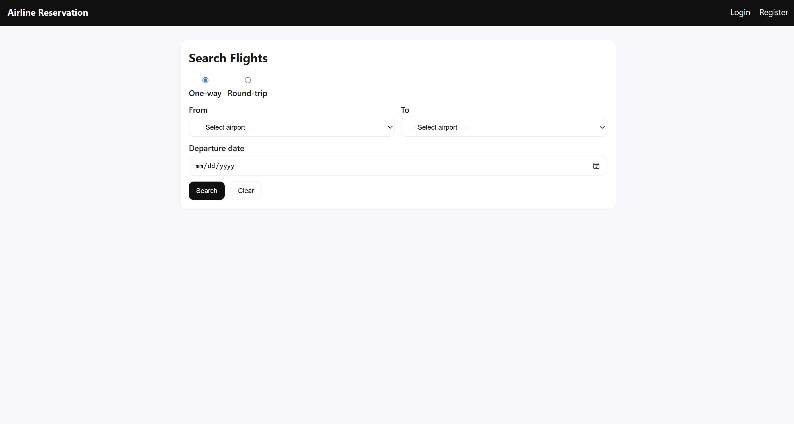
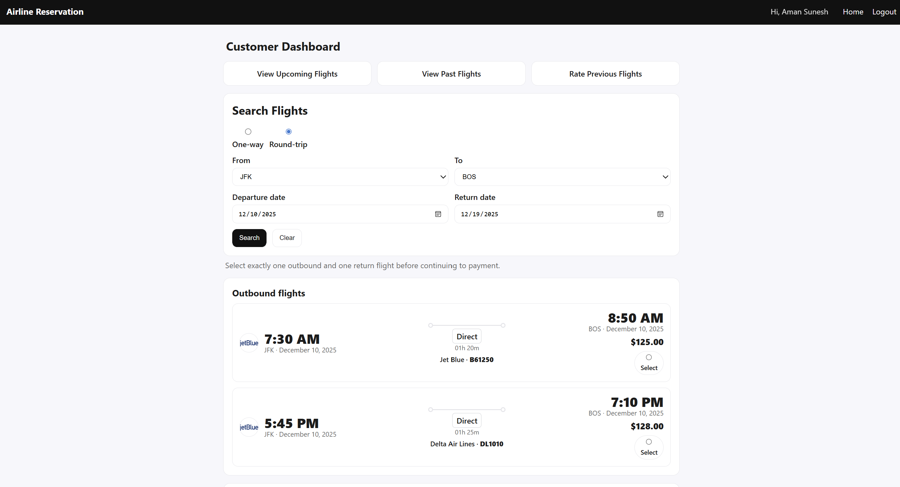
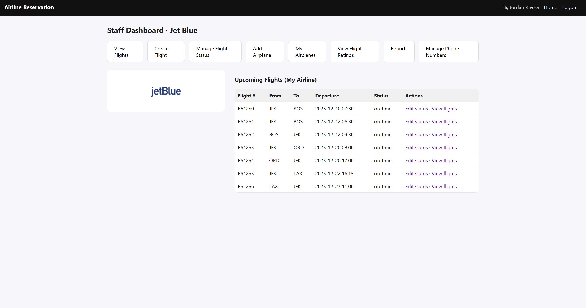

# Airline Ticket Reservation System (MySQL + Flask)

This project is a full‑stack **Airline Ticket Reservation System** built with **Python (Flask)** and **MySQL**.  
It supports customer bookings, airline staff operations, and basic analytics such as flight status management and revenue reports.

> This repository started as a course project and has been cleaned up so it can serve as a portfolio project as well.

---

## Features

### Customer Portal

- Customer registration and login
- Search for flights by:
  - Source & destination airports
  - Departure date (and optional return date for round trips)
  - One‑way and round‑trip options
- View flight details including:
  - Airline, flight number, airplane
  - Departure & arrival airports
  - Local departure/arrival time (timezone‑aware)
  - Computed flight duration
- Purchase tickets and view:
  - Upcoming trips
  - Past trips and travel history
- Rate completed flights (with protections against double‑rating)
- Cancel future trips (subject to airline rules, if enabled)

### Airline Staff Portal

- Staff registration & login (tied to a specific airline)
- Manage **airplanes**:
  - Add new airplanes with capacity, manufacturer, and age
- Manage **flights**:
  - Create new flights (with airplane, route, base price, and schedule)
  - Update flight status (on‑time, delayed, cancelled, etc.)
  - Edit existing flights when schedules change
- View **customers on a given flight**
- View **monthly revenue** and ticket sales statistics for their airline
- Search and filter flights by date range, route, or status

### Timezone‑Aware Scheduling

Flight departure and arrival datetimes are stored in the database and converted using IANA timezones (e.g., `America/New_York`, `Asia/Dubai`).

The application computes and displays **flight durations** in a user‑friendly format on search and booking pages.

---

## Tech Stack

- **Backend:** Python, Flask
- **Database:** MySQL
- **Frontend:** HTML, CSS (Jinja2 templates)
- **Other:** `pymysql`, `datetime`, `zoneinfo`

---

## Project Structure

```text
Airline-Ticket-Reservation-System-Using-MySQL-and-Flask/
│
├── db/                     # SQL schema and sample data files
├── screenshots              
├── static/
│   └── airlines/           # Static assets (e.g., airline logos)
├── templates/              # Flask HTML/Jinja templates
├── ER_Diagram.pdf          # Entity–Relationship diagram
├── relational_schema.pdf   # Relational schema design
├── main.py                 # Flask application entry point
├── requirements.txt        # Python dependencies
└── README.md               # Project documentation (this file)
```

---

## Getting Started

### 1. Prerequisites

- Python **3.9+**
- MySQL Server (local or remote)
- `pip` for installing Python packages

### 2. Clone the Repository

```bash
git clone https://github.com/Aman-Sunesh/Airline-Ticket-Reservation-System-Using-MySQL-and-Flask.git
cd Airline-Ticket-Reservation-System-Using-MySQL-and-Flask
```

### 3. Create & Activate a Virtual Environment (Optional but Recommended)

```bash
python -m venv venv

# macOS / Linux
source venv/bin/activate

# Windows
venv\Scripts\activate
```

### 4. Install Dependencies

```bash
pip install -r requirements.txt
```

### 5. Set Up the Database

1. Start your MySQL server.
2. Create a database (for example):
   ```sql
   CREATE DATABASE airline_reservation;
   ```
3. Use the SQL scripts in the `db/` directory to create tables and insert sample data, e.g.:
   ```bash
   mysql -u <your_username> -p airline_reservation < db/schema.sql
   mysql -u <your_username> -p airline_reservation < db/sample_data.sql
   ```

> Make sure that the database name you create matches the one configured in `main.py` (default: `airline_reservation`).

### 6. Configure Database Connection

In `main.py`, update the MySQL configuration if needed:

```python
conn = pymysql.connect(
    host='127.0.0.1',
    user='root',
    password='your_mysql_password',
    db='airline_reservation',
    charset='utf8mb4',
    cursorclass=pymysql.cursors.DictCursor
)
```

Alternatively, you can refactor this to read from environment variables for production use.

### 7. Run the Application

```bash
python main.py
```

By default, Flask will run on `http://127.0.0.1:5000/` (or as configured inside `main.py`).  
Open this URL in your browser to access the home page.

---

## Usage Overview

- **Home Page:** Choose whether to log in / register as a **Customer** or **Airline Staff**, or browse/search flights.
- **Customer Flow:**
  1. Register with your email and password.
  2. Log in and search for flights.
  3. Select flights, confirm details, and purchase tickets.
  4. View upcoming/past trips and rate completed flights.
- **Staff Flow:**
  1. Register as staff for a specific airline.
  2. Log in to access the staff dashboard.
  3. Add airplanes and flights, update statuses, view revenue and passenger lists.

---

## Screenshots 

  
  



---

## Possible Improvements

Some ideas for future extensions:

- Add role‑based access control with more granular permissions
- Support promotions, discount codes, and loyalty points
- Add seat selection with seat maps per airplane
- Integrate a real payment gateway (e.g. Stripe sandbox)
- Containerize the app using Docker for easier deployment

---

## License

This repository is currently shared for educational and portfolio purposes.  
Feel free to fork the project and experiment with it, but please credit the original authors if you reuse substantial parts of the code.
